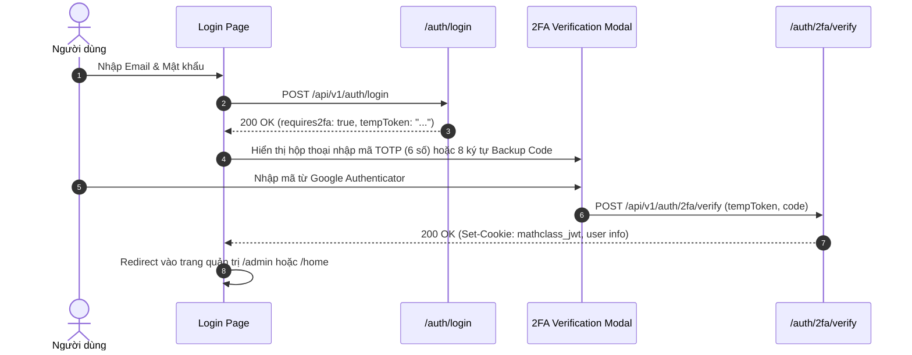

# 🔐 Cơ Chế Xác Thực & Bảo Mật (Auth & Security Guide)

Tài liệu này mô tả chi tiết toàn bộ cơ chế xác thực danh tính, phân quyền, bảo mật 2 lớp (2FA) và bảo vệ phiên làm việc trên hệ thống Frontend **MathClass**.

---

## 1. Mô Hình Xác Thực Tổng Quan

Hệ thống sử dụng cơ chế bảo mật kết hợp giữa **JWT (HttpOnly Cookie)**, **Role-Based Access Control (RBAC)** và **Next.js 16 Middleware Guard (`proxy.ts`)**:

- **Cookie `mathclass_jwt`:** Chứa JWT Access Token, được cấu hình `HttpOnly`, `SameSite=Lax`, `Secure` (trong production) do Spring Boot Backend quản lý.
- **Cookie `mathclass_role`:** Lưu Role của user (`STUDENT`, `TEACHER`, `ADMIN`) để `proxy.ts` định tuyến nhanh mà không cần decode token.
- **Redux Toolkit (`authSlice`):** Lưu trữ thông tin UserProfile hiển thị trên UI.

---

## 2. Luồng Xác Thực 2 Bước (2FA - TOTP & Backup Codes)

Hệ thống áp dụng chính sách 2FA bảo mật nghiêm ngặt:
- **Bắt buộc 100%** đối với tài khoản vai trò Quản trị viên (`ADMIN`).
- **Tuỳ chọn** đối với Giáo viên và Học sinh trong trang cài đặt tài khoản.



---

## 3. Quản Lý Phiên & Hàng Đợi Tự Động Gia Hạn Token (Refresh Mutex)

Để ngăn chặn **Race Condition** khi nhiều component đồng thời gọi API và nhận mã `401 Unauthorized`, Axios instance tại `@/lib/axios.ts` áp dụng cơ chế Mutex Queue:

```typescript
// Cấu trúc cơ chế hàng đợi Mutex tại lib/axios.ts
let isRefreshing = false;
let failedQueue: Array<{
  resolve: (value?: unknown) => void;
  reject: (reason?: unknown) => void;
}> = [];

const processQueue = (error: unknown) => {
  failedQueue.forEach((promise) => {
    if (error) {
      promise.reject(error);
    } else {
      promise.resolve();
    }
  });
  failedQueue = [];
};
```

1. **Yêu cầu đầu tiên gặp 401:** Đặt cờ `isRefreshing = true` và gọi endpoint `/auth/refresh-token`.
2. **Các yêu cầu 401 tiếp theo:** Được đẩy vào `failedQueue` để chờ kết quả.
3. **Khi refresh thành công:** Gọi lại toàn bộ các request trong queue với token mới.
4. **Khi refresh thất bại:** Đăng xuất người dùng và điều hướng về trang `/login`.

---

## 4. Xử Lý Khóa Tài Khoản (`ACCOUNT_LOCKED`)

Khi tài khoản người dùng bị Quản trị viên khóa trong lúc đang thao tác:
- Backend trả mã lỗi `403 Forbidden` hoặc `401 Unauthorized` kèm theo body chứa `errorCode: "ACCOUNT_LOCKED"` và `lockReason`.
- Axios Interceptor sẽ chặn lỗi này, dọn dẹp cookie phiên và hiển thị component `AccountLockedModal` thông báo lý do khóa cụ thể cho người dùng.

---

## 5. Middleware Bảo Vệ Định Tuyến (`proxy.ts`)

Trên **Next.js 16**, file `proxy.ts` đóng vai trò là middleware kiểm soát quyền truy cập trước khi trang render:
- Tuyệt đối cấm người dùng chưa đăng nhập vào các route `/(dashboard)/*` và `/admin/*`.
- Người dùng có role `STUDENT` hoặc `TEACHER` cố ý truy cập `/admin/*` sẽ bị chuyển hướng tức thì sang `/forbidden` (403).
- Người dùng đã đăng nhập khi truy cập `/login` hoặc `/signup` sẽ được tự động chuyển hướng về trang chủ phù hợp với role.
