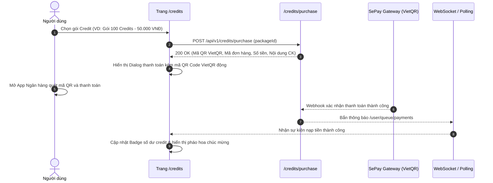

# 💳 Tích Hợp Hệ Thống Credit & Thanh Toán (Credits & Payment Flow)

Hệ thống tính phí AI trên MathClass hoạt động dựa trên mô hình Credit trả trước. Người dùng (Học sinh và Giáo viên) cần credit để thực hiện các thao tác trí tuệ nhân tạo như sinh đề toán, gợi ý giải toán từng bước và chấm bài tự động.

---

## 1. Mô Hình Sử Dụng & Báo Lỗi Hết Credit (HTTP 402)

| Thao tác AI | Chi phí Credit ước tính | Hook phụ trách |
| :--- | :--- | :--- |
| **Sinh đề toán học** (`AiQuestionGeneratorModal`) | 5 Credits / lần | `useAiQuestionGenerator` |
| **Gợi ý giải bài tập** (`SubmissionHints`) | 2 Credits / bước gợi ý | `useStudentHints` |
| **Chấm bài tự động** (`AiGrading`) | 3 Credits / bài làm | `useAiGrading` |

### Xử lý mã lỗi `402 Payment Required`
Khi số dư không đủ, Backend trả HTTP 402 kèm mã `INSUFFICIENT_CREDITS`:
- UI hiển thị Modal thông báo hết credit với lời mời nạp tiền trực quan.
- Chuyển hướng người dùng đến trang `/credits` để lựa chọn gói nạp.

---

## 2. Luồng Mua Gói Credit Qua Cổng SePay (VietQR)

---

## 3. Quản Lý Sổ Cái Giao Dịch (Credit Ledger)

Tại trang `/credits`:
- Hiển thị component `credit-balance-card`: Tổng credit hiện có, thống kê chi tiêu trong tháng.
- Hiển thị component `credit-transactions-table`: Lịch sử giao dịch chi tiết (Cộng credit do nạp tiền, Trừ credit khi gọi AI) hỗ trợ phân trang Server-side mượt mà bằng `placeholderData: keepPreviousData`.
