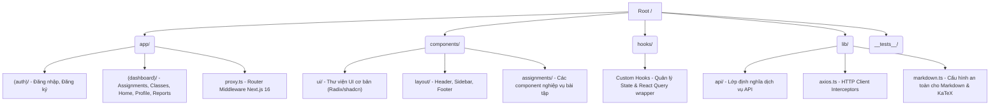

# Báo cáo Đánh giá Kiến trúc (Architectural Review Report) - MathClass-fe

Dự án: **MathClass-fe**  
Thời gian đánh giá: **10/07/2026**

Tài liệu này cung cấp cái nhìn tổng quan về kiến trúc hệ thống hiện tại của dự án `MathClass-fe`, phân tích các ưu điểm thiết kế, những điểm cần chú ý và các mô hình kiến trúc cốt lõi được áp dụng.

---

## 1. Bản đồ Kiến trúc Tổng quan (Architectural Blueprint)

Dự án được xây dựng dựa trên framework **Next.js 16 (App Router)** và ngôn ngữ **TypeScript**. Dưới đây là cấu trúc thư mục chính của dự án:

---

## 2. Các Mô Hình Thiết Kế Cốt Lõi (Core Architectural Patterns)

### 2.1. Phân chia Route Grouping & Phân quyền truy cập
*   **Mô tả:** Thư mục `app/` được phân tách thành hai Route Groups lớn:
    *   `(auth)`: Chứa các route công khai phục vụ đăng ký/đăng nhập.
    *   `(dashboard)`: Chứa toàn bộ các route nghiệp vụ yêu cầu xác thực.
*   **Cơ chế bảo vệ (Route Guarding):** 
    *   Sử dụng cơ chế **Next.js 16 Proxy Middleware** thông qua tệp [proxy.ts](../proxy.ts). Middleware này chạy ở Edge runtime, kiểm tra cookie `auth_token` và `user_role` để đưa ra quyết định redirect trước khi mã nguồn trang phía client được tải và kết xuất.
    *   Việc tách biệt này giúp ngăn chặn hiện tượng rò rỉ layout nội bộ cho người dùng chưa đăng nhập.

### 2.2. Kiến trúc Data Fetching & Caching
*   **React Query (TanStack Query):** 
    *   Được sử dụng làm nhân tố chính để đồng bộ dữ liệu giữa Client và API Server.
    *   Tất cả các API calls quan trọng đều được quản lý thông qua các React Query Hooks tùy chỉnh (nằm trong thư mục `hooks/`). Điều này giúp tách biệt hoàn toàn logic lấy dữ liệu (Data fetching) khỏi logic hiển thị UI (Render).
    *   Đã thiết lập `staleTime` hợp lý (2 phút) cho các dữ liệu ít thay đổi ở Dashboard để giảm tải số lượng requests lên API Server.

### 2.3. Lớp Giao Tiếp API & Quản Lý Token Tập Trung
*   **Axios Singleton:** Lớp HTTP Client được định nghĩa tập trung trong [axios.ts](../lib/axios.ts).
*   **Dịch vụ Quản lý Token Tập trung (`authStorage`):**
    *   Toàn bộ logic lưu trữ, đọc và dọn dẹp token xác thực (ở cả Cookies và Local/Session Storage) được tách biệt hoàn toàn và cô lập vào tệp [auth-storage.ts](../lib/auth-storage.ts).
    *   Giúp loại bỏ sự trùng lặp và rải rác của các lệnh truy cập storage trực tiếp trước đây.
*   **Request Interceptor:** 
    *   Tự động phát hiện môi trường thực thi (Client-side vs Server-side SSR).
    *   Nếu ở Client-side, gọi `authStorage.getToken()` để lấy token xác thực an toàn.
    *   Nếu ở Server-side (SSR), nạp động `cookies` từ `next/headers` để trích xuất token xác thực. Điều này giúp Axios hoạt động đồng nhất ở cả hai môi trường.
*   **Response Interceptor:** 
    *   Bắt lỗi `401 Unauthorized` tập trung. Khi token hết hạn hoặc không hợp lệ, interceptor tự động gọi `authStorage.clearToken()` để dọn dẹp sạch sẽ phiên hoạt động và chuyển hướng người dùng về trang đăng nhập `/login?expired=true`.

### 2.4. Code-Splitting và Tối ưu hóa Bundle Size
*   Sử dụng **Next.js Dynamic Imports (`next/dynamic`)** để trì hoãn việc tải các Module Dashboard rất nặng của Học sinh và Giáo viên trong [home-client.tsx](../app/(dashboard)/home/_components/home-client.tsx) cho đến khi xác định được quyền hạn của người dùng.
*   Cách thiết kế này tối ưu hóa dung lượng JS tải xuống ban đầu, giúp cải thiện đáng kể chỉ số LCP (Largest Contentful Paint) và tốc độ sẵn sàng tương tác của trang chủ.

### 2.5. Tích Hợp Markdown & Công Thức Toán Học LaTeX An Toàn
*   Sử dụng bộ ba plugin `remark-math`, `rehype-katex` và `rehype-raw` để render tài liệu toán học giàu định dạng.
*   Được bảo vệ bằng **`rehype-sanitize`** thông qua một schema tùy chỉnh mở rộng tại [markdown.ts](../lib/markdown.ts). Cơ chế này lọc sạch mọi mã độc Javascript chèn qua thẻ HTML thô (XSS) nhưng vẫn giữ lại các lớp CSS hiển thị công thức của KaTeX.

---

## 3. Điểm Cần Chú Ý & Đề Xuất Phát Triển (Areas for Notice)

1.  **Chuyển đổi hoàn toàn sang HttpOnly Cookie:** Mặc dù phía client đã được chuẩn hóa và đóng gói hoàn toàn trong `authStorage`, về lâu dài vẫn khuyến nghị chuyển đổi cơ chế cấp phát token từ Backend sang **HttpOnly Cookies** để loại bỏ hoàn toàn khả năng đọc token bằng Javascript (bảo vệ tối đa trước XSS).
2.  **Quản lý Axios Singleton trong SSR:** Do Axios là thực thể singleton, cần tránh lưu trữ các trạng thái mang tính chất "stateful" toàn cục của từng request cụ thể trong thuộc tính mặc định của instance (`api.defaults.headers`). Việc sử dụng request config trong Interceptors hiện tại là hướng đi an toàn.
3.  **Tách biệt Module UI Components:** Thư mục `components/ui` chứa các shadcn primitives dùng chung. Hãy luôn giữ các component này thuần túy hiển thị (presentational components) và không gắn bất kỳ logic gọi API trực tiếp nào vào đây.
