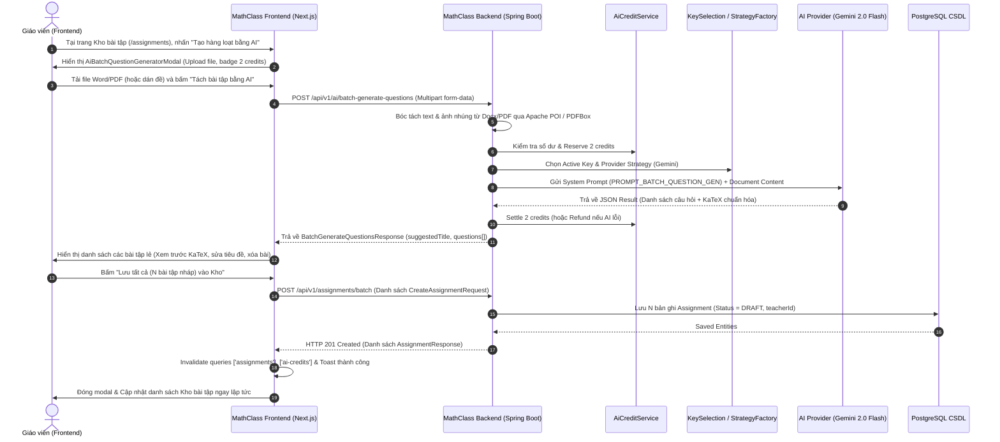

# Specification: Tạo Hàng Loạt Bài Tập Từ File Bằng AI (MAT-332)

## 1. Tổng quan (Overview)
- **Mã Ticket Jira**: `MAT-332`
- **Mục đích**: Cho phép Giáo viên tải lên tài liệu đề thi (File Microsoft Word `.docx`, PDF `.pdf`, hoặc Text `.txt`) hoặc dán văn bản thô để AI tự động phân tích, bóc tách từng câu hỏi/bài toán thành các bài tập bản nháp (DRAFT) riêng biệt và lưu đồng loạt vào Kho bài tập của giáo viên.
- **Đối tượng áp dụng**: Giáo viên (Role `TEACHER`, `ADMIN`) có quyền `assignment:create`.
- **Định mức Chi phí (Credit Quota)**: **2 Credits / lượt tạo** (`BATCH_QUESTION_GEN`). Miễn phí đối với tài khoản `ADMIN`.

---

## 2. Luồng Nghiệp vụ & Kiến trúc Hệ thống (Workflow & Architecture)



---

## 3. Cấu hình Quản trị & Đồng Bộ AI Config (Admin Sync)

### 3.1. Hạn ngạch Tác vụ (Task & Credit Config)
- **Task Code**: `BATCH_QUESTION_GEN`
- **Tên hiển thị tiếng Việt**: `AI tách đề`
- **Chi phí mặc định**: `costPerCall = 2` credits (`tokensPerCredit = 1000`)
- **Seeding tự động**: Được khởi tạo trong [DatabaseSeeder.java](file:///c:/Math-class/MathClass-service/src/main/java/com/codegym/mathclass/config/DatabaseSeeder.java).
- **Admin Task Routing**: Xuất hiện trong tab **Điều phối Tác vụ (Task Routing)** của Quản trị viên để cấu hình Model, Provider, Temperature, Max Tokens, Bật/Tắt tác vụ.

### 3.2. System Prompt Chuyên Dụng
- **Prompt Code**: `PROMPT_BATCH_QUESTION_GEN`
- **Tên Prompt**: `Prompt Tách Đề Thi Hàng Loạt Từ Tài Liệu`
- **Nội dung chính**:
  - Hướng dẫn AI đọc tài liệu và tự động bóc tách từng bài toán/câu hỏi thành một phần tử độc lập trong mảng `questions`.
  - Tự động đặt Tiêu đề (`title`) ngắn gọn, súc tích cho từng bài tập lẻ.
  - Giữ nguyên vị trí các mã ảnh nhúng `[IMAGE_...]` nếu tài liệu có hình ảnh.
  - Chuẩn hóa toàn bộ công thức toán học, đại lượng, biến số trong cặp dấu đô-la `$ ... $` hoặc `$$ ... $$` chuẩn KaTeX.
  - Không kèm lời giải chi tiết và không kèm mô tả thừa thãi.
  - Trả về duy nhất một JSON Object đúng schema.

---

## 4. Đặc Tả Dữ Liệu & API Endpoints

### 4.1. API Tách Đề Thi Từ Tài Liệu Bằng AI
- **URL**: `/api/v1/ai/batch-generate-questions`
- **Method**: `POST`
- **Content-Type**: `multipart/form-data`
- **Headers**: `Authorization: Bearer <JWT>`
- **Quyền hạn**: `hasAnyRole('TEACHER', 'ADMIN')` hoặc `hasAuthority('assignment:create')`

#### Request Parameters (Multipart Form-data):
| Field | Type | Bắt buộc | Mô tả |
| :--- | :--- | :--- | :--- |
| `file` | `MultipartFile` | Không | File Word (`.docx`), PDF (`.pdf`), hoặc Text (`.txt`) tối đa 15MB |
| `textContent` | `String` | Không | Nội dung đề bài văn bản thô dán trực tiếp |
| `includeExplanation` | `Boolean` | Không | Mặc định `false` |

*(Bắt buộc phải có ít nhất `file` hoặc `textContent`)*

#### Response Body (`BatchGenerateQuestionsResponse`):
```json
{
  "suggestedTitle": "Đề thi khảo sát chất lượng Toán 9",
  "questions": [
    {
      "id": "q1",
      "title": "Bài 1: Rút gọn biểu thức chứa căn",
      "content": "Cho biểu thức $P = \\left(\\frac{\\sqrt{x}}{\\sqrt{x}+1} + \\frac{1}{x-\\sqrt{x}}\\right) : \\frac{\\sqrt{x}}{x-1}$. Rút gọn $P$ với $x > 0, x \\neq 1$."
    },
    {
      "id": "q2",
      "title": "Bài 2: Giải hệ phương trình",
      "content": "Giải hệ phương trình sau: $\\begin{cases} 2x + y = 5 \\\\ x - 3y = -1 \\end{cases}$"
    }
  ],
  "totalQuestions": 2,
  "extractedImages": [],
  "model": "gemini-2.0-flash"
}
```

---

### 4.2. API Tạo Hàng Loạt Bài Tập Bản Nháp (Batch Create Assignments)
- **URL**: `/api/v1/assignments/batch`
- **Method**: `POST`
- **Content-Type**: `application/json`
- **Headers**: `Authorization: Bearer <JWT>`
- **Quyền hạn**: `hasAuthority('assignment:create')`

#### Request Body (`List<CreateAssignmentRequest>`):
```json
[
  {
    "title": "Bài 1: Rút gọn biểu thức chứa căn",
    "content": "Cho biểu thức $P = ...$",
    "allowResubmit": true,
    "images": []
  },
  {
    "title": "Bài 2: Giải hệ phương trình",
    "content": "Giải hệ phương trình sau: ...",
    "allowResubmit": true,
    "images": []
  }
]
```

#### Response Body (`List<AssignmentResponse>`): HTTP 201 Created (Danh sách bài tập DRAFT vừa tạo).

---

## 5. UI/UX Specification (Frontend)

### 5.1. Vị trí Nút Khởi Chạy
- Đặt tại trang **Kho bài tập của Giáo viên** (`/assignments`).
- Nút bấm: `<button className="... bg-gradient-to-r from-blue-600 to-indigo-600 ...">` với icon `Sparkles` và nhãn `"Tạo hàng loạt bằng AI"`, nằm liền kề bên trái nút `"Tạo bài tập mới"`.

### 5.2. Modal Tách Đề (`AiBatchQuestionGeneratorModal`)
1. **Bước 1 (Upload & Nhập liệu)**:
   - Khu vực Drag & Drop chọn file tài liệu (`.docx`, `.pdf`, `.txt`) tối đa 15MB.
   - Textarea dán trực tiếp đề bài nếu không muốn tải file.
   - Huy hiệu `2 Credits / lượt` hiển thị rõ ràng.
   - Nút `"Tách bài tập bằng AI"` (kèm Spinner khi đang xử lý).
2. **Bước 2 (Xem trước & Lưu nháp)**:
   - Thanh tóm tắt: Đã tách thành $N$ bài tập độc lập (Lưu dưới dạng bản nháp DRAFT).
   - Danh sách các bài tập lẻ:
     - Badge số thứ tự bài (`Bài 1`, `Bài 2`...).
     - Ô input chỉnh sửa nhanh tiêu đề bài tập (AI tự đặt tiêu đề theo nội dung câu).
     - Hộp xem trước Markdown + KaTeX toán học sắc nét.
     - Nút Thùng rác (Xóa bài) nếu không muốn tạo bài đó.
   - Nút `"Đổi file khác"` để quay lại bước 1.
   - Nút `"Lưu tất cả (N bài tập nháp) vào Kho"`: Gọi API Batch, tự động refresh danh sách và đóng modal.

---

## 6. Tiêu Chuẩn Kiểm Thử & Verification Checklist

1. **Frontend Specs (`vitest`)**:
   - `__tests__/components/ai/AiBatchQuestionGeneratorModal.test.tsx`:
     - Test trạng thái đóng/mở modal.
     - Test render thành phần UI ban đầu.
     - Test gọi API tách đề và render danh sách bài tập.
     - Test lưu đồng loạt vào kho bài tập.
   - `__tests__/services/aiBatchQuestionService.test.ts`:
     - Test gửi FormData textContent và File.
2. **Backend Specs (`JUnit 5 / Mockito`)**:
   - `AiBatchQuestionServiceImplTest.java`:
     - Test validate rỗng.
     - Test bóc tách từ text.
     - Test bóc tách từ file Word đính kèm.
   - `AiQuestionControllerTest.java`:
     - Test Controller endpoint `POST /api/v1/ai/batch-generate-questions`.
3. **Chất lượng Code**:
   - TypeScript Check: `npx tsc --noEmit` (Pass 100%).
   - ESLint: `npm run lint` (Pass 100%).
   - Gradle Build: `./gradlew compileJava` & `./gradlew test` (Pass 100%).
