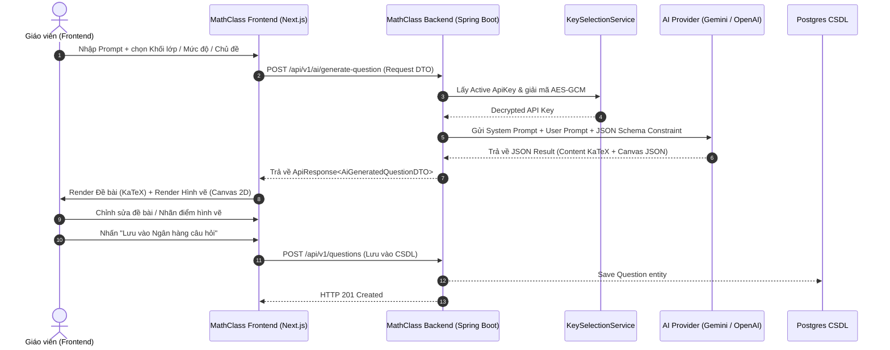

# Specification: AI Math Question & Canvas Diagram Generator (MAT-251)

## 1. Tổng quan (Overview)
- **Mã Ticket Jira**: `MAT-251`
- **Mục đích**: Cho phép Giáo viên nhập yêu cầu bằng lời (Prompt) kết hợp với các bộ lọc tiêu chuẩn (Khối lớp, Mức độ tư duy, Chủ đề) để AI tự động sinh ra câu hỏi Toán học kèm công thức KaTeX và dữ liệu cấu hình hình vẽ Canvas (Canvas JSON).
- **Đối tượng áp dụng**: Giáo viên (Role `TEACHER`, `ADMIN`).

---

## 2. Luồng Nghiệp vụ & Kiến trúc Hệ thống (Workflow & Architecture)



---

## 3. Quy chuẩn Dữ liệu (Data Schemas)

### 3.1. Dữ liệu Hình vẽ Canvas (`CanvasDataDTO`)
Dữ liệu hình vẽ do AI sinh ra phải tuân thủ JSON Schema chuẩn xác để Frontend có thể render lại một cách linh hoạt:

```json
{
  "width": 500,
  "height": 400,
  "elements": [
    {
      "type": "point",
      "id": "O",
      "x": 250,
      "y": 200,
      "label": "O",
      "labelPosition": "top-left"
    },
    {
      "type": "circle",
      "id": "circle_O",
      "centerId": "O",
      "radius": 120,
      "style": "solid"
    },
    {
      "type": "point",
      "id": "A",
      "x": 250,
      "y": 80,
      "label": "A",
      "labelPosition": "top"
    },
    {
      "type": "point",
      "id": "B",
      "x": 145,
      "y": 260,
      "label": "B",
      "labelPosition": "bottom-left"
    },
    {
      "type": "point",
      "id": "C",
      "x": 355,
      "y": 260,
      "label": "C",
      "labelPosition": "bottom-right"
    },
    {
      "type": "segment",
      "id": "seg_AB",
      "fromId": "A",
      "toId": "B",
      "style": "solid"
    },
    {
      "type": "segment",
      "id": "seg_BC",
      "fromId": "B",
      "toId": "C",
      "style": "solid"
    },
    {
      "type": "segment",
      "id": "seg_CA",
      "fromId": "C",
      "toId": "A",
      "style": "solid"
    }
  ]
}
```

---

## 4. API Endpoints Specification

### 4.1. Endpoint Sinh Bài Toán AI
- **URL**: `/api/v1/ai/generate-question`
- **Method**: `POST`
- **Headers**: `Authorization: Bearer <JWT>`

#### Request Body (`GenerateQuestionRequestDTO`):
```json
{
  "prompt": "Cho tam giác ABC nhọn nội tiếp đường tròn (O; R). Vẽ đường cao AH.",
  "grade": 9,
  "difficulty": "THONG_HIEU",
  "topic": "Hình học 9 - Đường tròn",
  "questionType": "ESSAY",
  "includeCanvasDiagram": true
}
```

#### Response Body (`ApiResponse<AiGeneratedQuestionDTO>`):
```json
{
  "code": 1000,
  "message": "Success",
  "result": {
    "title": "Bài toán tam giác nội tiếp đường tròn",
    "content": "Cho tam giác $ABC$ nhọn nội tiếp đường tròn $(O; R)$. Gọi $H$ là chân đường cao hạ từ $A$ xuống $BC$. Chứng minh rằng...",
    "explanation": "Lời giải chi tiết từng bước...",
    "grade": 9,
    "difficulty": "THONG_HIEU",
    "topic": "Hình học 9 - Đường tròn",
    "canvasData": {
      "width": 500,
      "height": 400,
      "elements": [...]
    }
  }
}
```

---

## 5. UI/UX Design Standards (Frontend)

1. **Giao diện Sinh bài toán (`AiQuestionGeneratorModal` / Form)**:
   - Input Prompt (Textarea lớn, placeholder rõ ràng).
   - Filter bar: Select `Khối lớp` (6 đến 12), Select `Mức độ` (Nhận biết, Thông hiểu, Vận dụng, Vận dụng cao), Input `Chủ đề`.
   - Nút `Sinh đề bằng AI` (kèm Spinner & hiệu ứng shimmer loading).

2. **Giao diện Xem trước & Chỉnh sửa (Preview & Edit Panel)**:
   - **Cột trái**: Trình biên soạn Đề bài KaTeX + Lời giải (có chế độ gõ Markdown/KaTeX live preview).
   - **Cột phải**: Canvas Render (dùng HTML5 Canvas API / Konva.js render hình vẽ 2D từ `canvasData`, cho phép kéo di chuyển nhãn/điểm).
   - **Action Bar**: Nút `Tạo lại (Regenerate)` và `Lưu vào Ngân hàng câu hỏi`.

---

## 6. Verification & Test Criteria

1. **Backend Unit & Integration Tests**:
   - `AiQuestionServiceTest`: Verify Prompt formatting, Exception handling khi API Key bị lỗi.
   - `AiQuestionControllerTest`: Test validation `@Valid` trên Request DTO.

2. **Frontend Quality Checklist**:
   - TypeScript Strict Type Check: `npx tsc --noEmit`
   - ESLint: `npm run lint`
   - KaTeX rendering không bị lỗi vỡ layout hoặc vỡ ký tự toán.
