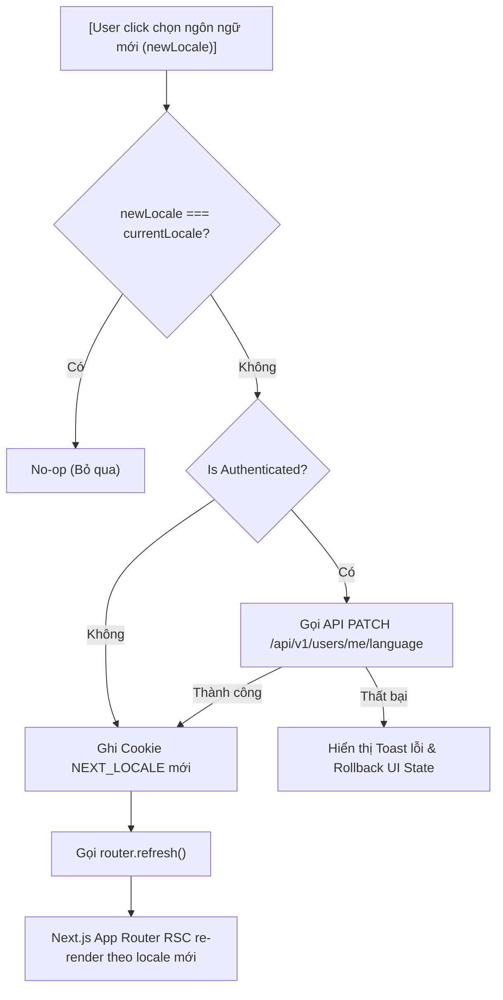

# [MAT-404] Đặc Tả Thiết Kế Kỹ Thuật Frontend: Cấu Hình Đa Ngôn Ngữ (i18n) & Xử Lý Session Locale

Tài liệu đặc tả kỹ thuật chi tiết dành riêng cho ứng dụng Frontend (`MathClass-fe`).

---

## 1. Kiến Trúc & Source of Truth (Frontend Scope)

### Phân định vai trò Cookie `NEXT_LOCALE`
- Cookie `NEXT_LOCALE` lưu trữ ngôn ngữ hiện tại của phiên làm việc trên trình duyệt (Browser Client) và môi trường Next.js App Router (Server Scope / RSC).
- Cookie `NEXT_LOCALE` đóng vai trò điều hướng giao diện UI hiện tại nhưng **không phải** là Source of Truth duy nhất của toàn bộ hệ thống.

### Nguyên tắc đồng bộ & Quy tắc chống ghi đè ngược (Conflict Prevention Rule)
- **Khi người dùng Đăng nhập thành công:** Frontend đọc thông tin `language` từ `AuthResponse` trả về bởi Backend để ghi đè vào Cookie `NEXT_LOCALE` của trình duyệt.
- ⛔ **Chống ghi đè ngược:** Tuyệt đối **không** tự động kích hoạt API `PATCH /api/v1/users/me/language` để ghi đè ngược locale của trình duyệt lên Database ngay sau khi vừa đăng nhập thành công.
- **Khi người dùng chủ động đổi ngôn ngữ trên UI:** 
  1. Nếu đã đăng nhập: Gọi API `PATCH /api/v1/users/me/language` lên Backend.
  2. Cập nhật Cookie `NEXT_LOCALE`.
  3. Kích hoạt re-render lại toàn bộ trang web theo locale mới.

---

## 2. Thương Lượng Locale Ở Middleware (Next.js 15 Middleware)

### Cấu hình thuật toán ở `middleware.ts`
- Thuật toán thương lượng locale tại Next.js `middleware.ts` bắt buộc phải sử dụng chung cấu hình và đồng bộ 100% logic với Backend:
  ```typescript
  export const SUPPORTED_LOCALES = ['vi', 'en'] as const;
  export const DEFAULT_LOCALE = 'vi';
  ```
- **Thứ tự ưu tiên thương lượng:**
  1. Đọc giá trị Cookie `NEXT_LOCALE`. Nếu thuộc `SUPPORTED_LOCALES` $\rightarrow$ Chọn locale này.
  2. Nếu không có Cookie hoặc Cookie không hợp lệ: Trích xuất header `Accept-Language` từ Browser request, parse theo trọng số `q-factor`, lấy mã ISO-639-1 2 ký tự đầu tiên khớp với `SUPPORTED_LOCALES`.
  3. Fallback an toàn về `DEFAULT_LOCALE` (`vi`).

---

## 3. Đọc Locale Chuẩn Xác Giữa Client & Server Scope (Next.js 15 Safe)

### 3.1 Client Side Scope (Axios Interceptor)
- Đọc Cookie `NEXT_LOCALE` trực tiếp qua helper `document.cookie` / cookie parser phía client.
- **Tuyệt đối không** import `next/headers` trong Client Components hoặc các file JS/TS chạy phía Client.
- **Axios Interceptor Configuration:** Tự động đính kèm header `Accept-Language` vào mọi HTTP Request gửi tới Backend:
  ```typescript
  import axios from 'axios';
  import { getCookie } from 'cookies-next';

  export const axiosInstance = axios.create({
    baseURL: process.env.NEXT_PUBLIC_API_BASE_URL,
  });

  axiosInstance.interceptors.request.use((config) => {
    if (typeof window !== 'undefined') {
      const locale = getCookie('NEXT_LOCALE') || DEFAULT_LOCALE;
      config.headers['Accept-Language'] = locale;
    }
    return config;
  });
  ```

### 3.2 Server Side Scope (RSC / Server Actions)
- Đọc Cookie an toàn bằng `await cookies()` từ `next/headers` trong phạm vi Server Component hoặc Server Actions:
  ```typescript
  import { cookies } from 'next/headers';

  export async function getLanguageOnServer(): Promise<string> {
    const cookieStore = await cookies();
    return cookieStore.get('NEXT_LOCALE')?.value || DEFAULT_LOCALE;
  }
  ```

---

## 4. Cơ Chế Re-render Chuẩn Sau Khi Đổi Ngôn Ngữ

### Quy trình thực thi chuẩn (Execution Sequence)



### Xử Lý Rollback UI Khi API Thất Bại
Nếu API `PATCH /api/v1/users/me/language` thất bại (ví dụ: mất mạng, 500 Internal Server Error):
- Giữ nguyên Cookie `NEXT_LOCALE` cũ.
- Rollback lựa chọn ngôn ngữ trên UI Language Switcher về `currentLocale`.
- Hiển thị Toast thông báo lỗi cho người dùng.

---

## 5. Đặc Tả Cookie `NEXT_LOCALE`

| Thuộc tính | Giá trị / Cấu hình | Ghi chú |
| :--- | :--- | :--- |
| **Cookie Name** | `NEXT_LOCALE` | Tên cookie chuẩn của Next.js i18n |
| **Path** | `/` | Khả dụng trên toàn bộ ứng dụng |
| **Max-Age** | `31536000` | Thời hạn 1 năm (365 ngày) |
| **SameSite** | `Lax` | Bảo vệ chống CSRF, hỗ trợ điều hướng từ link ngoài |
| **Secure** | `true` (Production) / `false` (Dev) | Bắt buộc `true` khi chạy trên HTTPS |
| **HttpOnly** | `false` | **Bắt buộc false** để Client JS đọc được Cookie và gắn vào Axios Header `Accept-Language` |

---

## 6. Xử Lý Lỗi Tập Trung & Tách Biệt Code / Message

- Frontend xử lý logic lỗi dựa vào thuộc tính `code` trong JSON phản hồi từ API Backend.
- **Không bao giờ** đối chiếu logic dựa trên chuỗi `message` vì `message` thay đổi theo từng ngôn ngữ:
  ```typescript
  try {
    await updateLanguageApi({ language: newLocale });
  } catch (error: any) {
    const errorCode = error?.response?.data?.code;
    if (errorCode === 'USER_LANGUAGE_INVALID') {
      // Handle invalid language code logic
    }
  }
  ```

---

## 7. Kịch Bản Kiểm Thử Frontend & E2E (Test Suite Matrix)

### 7.1 Frontend Unit & Component Tests
- Test Next.js Middleware negotiation: Đảm bảo chọn đúng locale từ Cookie $\rightarrow$ Header `Accept-Language` $\rightarrow$ Default fallback (`vi`).
- Test Client Axios Interceptor: Đảm bảo gắn đúng header `Accept-Language` khi gửi request API từ trình duyệt, safe check `window !== 'undefined'`.
- Test Component Language Switcher: Đảm bảo kích hoạt đúng flow đổi ngôn ngữ và rollback state khi API thất bại.
- Test Login Flow: Đảm bảo sau khi login thành công, `NEXT_LOCALE` cookie được cập nhật từ `AuthResponse.language`, và không kích hoạt API `PATCH /users/me/language` tự động.

### 7.2 End-to-End Tests (Playwright)
- **Scenario 1 (Guest User):** Truy cập lần đầu bằng trình duyệt tiếng Anh $\rightarrow$ Cookie `NEXT_LOCALE` khởi tạo `en` $\rightarrow$ UI hiển thị tiếng Anh.
- **Scenario 2 (Authenticated User Login):** Người dùng có `users.language = 'en'` đăng nhập $\rightarrow$ Cookie `NEXT_LOCALE` được đặt thành `en` $\rightarrow$ Giao diện hiển thị tiếng Anh.
- **Scenario 3 (Switch Language):** Người dùng chủ động chuyển sang `vi` $\rightarrow$ API `PATCH /api/v1/users/me/language` thành công $\rightarrow$ Cookie đổi thành `vi` $\rightarrow$ Trang được re-render chính xác thành Tiếng Việt.
