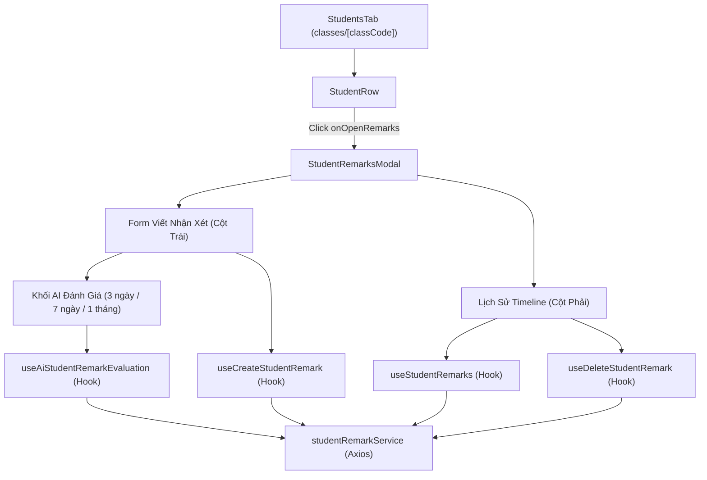

# Specification: Quản lý Lịch sử Nhận xét Học sinh (Student Remarks - UI/UX Frontend)

## 1. Tổng quan & Mục tiêu (Executive Summary & Objectives)

Tính năng **Ghi nhận & Theo dõi Lịch sử Nhận xét Học sinh (Student Remarks)** trên giao diện lớp học (`/classes/[classCode]`) cho phép:
- Giáo viên viết các nhận xét định tính (Điểm mạnh, Điểm yếu cần khắc phục, Đánh giá chung & Lời khuyên) cho từng học sinh trong lớp.
- Hiển thị dòng thời gian (timeline) lịch sử các lần đánh giá theo dạng Accordion/Dropdown trực quan.
- Tự động phân quyền hiển thị (giáo viên có quyền `classroom:manage_requests` mới có thể tạo/xóa nhận xét; học sinh chỉ được xem nhận xét của bản thân).

---

## 2. Tiêu chí Chấp nhận (Acceptance Criteria - AC)

### 2.1. Tích hợp tại Bảng danh sách Học sinh (`StudentsTab` & `StudentRow`)
- [ ] **AC-UI-01:** Mỗi hàng học sinh (`StudentRow`) hiển thị thêm nút icon nhận xét (`MessageSquareQuote`). Khi hover vào hàng, icon sẽ xuất hiện rõ ràng kèm tooltip giải thích.
- [ ] **AC-UI-02:** Click vào nút icon trên mở `StudentRemarksModal` tương ứng với học sinh được chọn.

### 2.2. Modal Chi tiết Hồ sơ & Lịch sử Nhận xét (`StudentRemarksModal`)
- [ ] **AC-UI-03:** Modal chia bố cục 2 cột linh hoạt (Split 2 Columns):
  - **Cột Trái (Viết nhận xét mới):**
    - 3 khối nhập liệu trực quan: *Điểm mạnh & Ưu điểm* (Xanh lá), *Điểm yếu & Cần cải thiện* (Vàng cam), *Đánh giá chung & Lời khuyên* (Xanh dương).
    - Validate bắt buộc phải nhập ít nhất 1 trong 3 trường mới cho phép gửi.
    - Phân quyền: Được bọc trong `PermissionGuard("classroom:manage_requests")`. Nếu không có quyền, hiển thị thông báo chế độ chỉ xem.
  - **Cột Phải (Lịch sử nhận xét):**
    - Hiển thị số lượng nhận xét, mặc định mở rộng nhận xét mới nhất, các nhận xét cũ hơn ở trạng thái thu gọn có badge tóm tắt.
    - Cho phép click từng mục để toggle mở/đóng xem chi tiết độc lập.
    - Hiển thị mốc thời gian định dạng tiếng Việt (`formatDateTime`) và tên giáo viên đánh giá.
    - Xử lý các trạng thái: Loading skeleton, Empty state khi chưa có nhận xét nào.
- [ ] **AC-UI-04:** Thao tác xóa nhận xét được bảo vệ bởi modal cảnh báo xác nhận `AlertDialog` tránh bấm nhầm.

### 2.3. Trợ lý AI Quét & Đánh giá Tiến độ Học sinh (`AI Assistant Evaluation`)
- [ ] **AC-UI-07:** Tích hợp khối trợ lý AI tại Cột Trái của modal khi cờ tính năng `STUDENT_REMARK` được bật bởi Admin.
- [ ] **AC-UI-08:** Cung cấp bộ nút chọn nhanh mốc thời gian: **3 ngày**, **7 ngày**, **1 tháng (30 ngày)**.
- [ ] **AC-UI-09:** Nút **"Quét & Đánh giá"** gọi API `POST /api/v1/classrooms/{classCode}/students/{studentId}/remarks/ai-evaluate` với trạng thái loading spinner (`Loader2`).
- [ ] **AC-UI-10:** Khi nhận kết quả từ AI, tự động điền các trường:
  - *Điểm mạnh & Ưu điểm*
  - *Điểm yếu & Cần cải thiện*
  - *Đánh giá chung & Lời khuyên* (bao gồm câu mở đầu tóm tắt số bài hoàn thành $X/Y$ trong khoảng thời gian quét, những điểm cần cải thiện và phương pháp luyện tập).
- [ ] **AC-UI-11:** Hiển thị banner thông báo xanh lá tóm tắt mốc thời gian đã quét: `Quét từ dd/MM/yyyy đến dd/MM/yyyy • Đã nộp X/Y bài (Z bài còn hạn, K bài quá hạn)`.
- [ ] **AC-UI-12:** Giáo viên có thể rà soát, chỉnh sửa trực tiếp nội dung gợi ý của AI trước khi nhấn **"Lưu nhận xét học sinh"**.

### 2.4. Tối ưu Trải nghiệm (UX/State Management)
- [ ] **AC-UI-13:** Tự động reset form nhập, thông tin quét AI và trạng thái mở rộng khi modal mở lên hoặc khi chuyển qua học sinh khác.
- [ ] **AC-UI-14:** Sử dụng React Query (`useStudentRemarks`, `useAiStudentRemarkEvaluation`) với khóa cache `['student-remarks', classCode, studentId]`, tự động làm tươi dữ liệu và cập nhật số dư credit (`['user-credit-balance']`).

---

## 3. Kiến trúc Frontend & Component Breakdown



---

## 4. Verification & Testing Strategy

### 4.1. Frontend Test Matrix & Coverage
| Layer | Test Suite File | Test Scenario | Status |
| :--- | :--- | :--- | :--- |
| **Service** | `studentRemarkService.test.ts` | `getRemarks`: Lấy mảng danh sách nhận xét thành công | ✅ Pass |
| **Service** | `studentRemarkService.test.ts` | `getRemarks`: Trả về `[]` khi dữ liệu không phải array | ✅ Pass |
| **Service** | `studentRemarkService.test.ts` | `createRemark`: Gửi payload POST tạo nhận xét mới | ✅ Pass |
| **Service** | `studentRemarkService.test.ts` | `deleteRemark`: Gửi request DELETE xóa nhận xét | ✅ Pass |
| **Service** | `studentRemarkService.test.ts` | `evaluateWithAi`: Gửi request POST `/ai-evaluate` với timeframe | ✅ Pass |
| **Hook** | `useStudentRemarks.test.tsx` | `useStudentRemarks`: Query nhận xét khi có classCode & studentId | ✅ Pass |
| **Hook** | `useStudentRemarks.test.tsx` | `useStudentRemarks`: Disabled khi studentId = null | ✅ Pass |
| **Hook** | `useStudentRemarks.test.tsx` | `useCreateStudentRemark`: Gọi mutation & invalidate query cache | ✅ Pass |
| **Hook** | `useStudentRemarks.test.tsx` | `useCreateStudentRemark`: Ném lỗi khi studentId = null | ✅ Pass |
| **Hook** | `useStudentRemarks.test.tsx` | `useDeleteStudentRemark`: Gọi mutation xóa & invalidate cache | ✅ Pass |
| **Hook** | `useStudentRemarks.test.tsx` | `useDeleteStudentRemark`: Ném lỗi khi studentId = null | ✅ Pass |
| **Hook** | `useStudentRemarks.test.tsx` | `useAiStudentRemarkEvaluation`: Gọi AI & invalidate credit cache | ✅ Pass |
| **Component** | `student-remarks-modal.test.tsx` | Không hiển thị modal khi `open = false` | ✅ Pass |
| **Component** | `student-remarks-modal.test.tsx` | Hiển thị thông tin học sinh khi `open = true` | ✅ Pass |
| **Component** | `student-remarks-modal.test.tsx` | Hiển thị empty state khi chưa có nhận xét nào | ✅ Pass |
| **Component** | `student-remarks-modal.test.tsx` | Hiển thị danh sách nhận xét với đầy đủ badge thông tin | ✅ Pass |
| **Component** | `student-remarks-modal.test.tsx` | Validate disable nút submit khi toàn bộ trường rỗng | ✅ Pass |
| **Component** | `student-remarks-modal.test.tsx` | Nhập form và submit gọi createMutation thành công | ✅ Pass |
| **Component** | `student-remarks-modal.test.tsx` | Mở `AlertDialog` cảnh báo khi click nút xóa nhận xét | ✅ Pass |
| **Component** | `student-remarks-modal.test.tsx` | Hiển thị chế độ chỉ xem khi không có quyền manage_requests | ✅ Pass |
| **Component** | `student-remarks-modal.test.tsx` | Chọn mốc ngày (3 ngày, 7 ngày, 1 tháng) & click "Quét & Đánh giá" | ✅ Pass |
| **Component** | `student-remarks-modal.test.tsx` | Tự động điền dữ liệu gợi ý & hiển thị / đóng banner kết quả AI | ✅ Pass |
| **Component** | `student-remarks-modal.test.tsx` | Click vào nhận xét trong danh sách để mở rộng / thu gọn chi tiết | ✅ Pass |

### 4.2. Verification Commands
```bash
# 1. Typecheck toàn bộ TypeScript
npx tsc --noEmit

# 2. Chạy toàn bộ Unit Tests của Student Remarks
npm test -- __tests__/components/classes/student-remarks-modal.test.tsx __tests__/hooks/useStudentRemarks.test.tsx __tests__/services/studentRemarkService.test.ts --run
```

**Kết quả kiểm tra:** 
- TypeScript: 0 errors (`exit code 0`).
- Vitest: **23/23 tests passed** (`3 passed (3)`).

