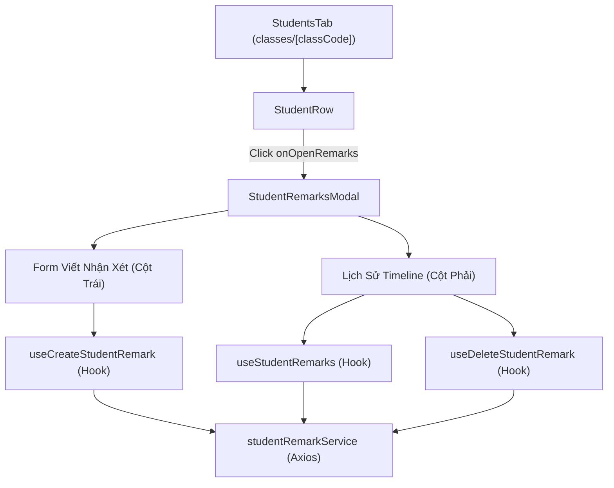

# Specification: Quản lý Lịch sử Nhận xét Học sinh (Student Remarks - UI/UX Frontend)

## 1. Tổng quan & Mục tiêu (Executive Summary & Objectives)

Tính năng **Ghi nhận & Theo dõi Lịch sử Nhận xét Học sinh (Student Remarks)** trên giao diện lớp học (`/classes/[classCode]`) cho phép:
- Giáo viên viết các nhận xét định tính (Điểm mạnh, Điểm yếu cần khắc phục, Đánh giá chung & Lời khuyên) cho từng học sinh trong lớp.
- Hiển thị dòng thời gian (timeline) lịch sử các lần đánh giá theo dạng Accordion/Dropdown trực quan.
- Tự động phân quyền hiển thị (giáo viên có quyền `classroom:manage_requests` mới có thể tạo/xóa nhận xét; học sinh chỉ được xem nhận xét của bản thân).

---

## 2. Tiêu chí Chấp nhận (Acceptance Criteria - AC)

### 2.1. Tích hợp tại Bảng danh sách Học sinh (`StudentsTab` & `StudentRow`)
- [ ] **AC-UI-01:** Mỗi hàng học sinh (`StudentRow`) hiển thị thêm nút icon nhận xét (`MessageSquareQuote`). Khi hover vào hàng, icon sẽ xuất hiện rõ ràng kèm tooltip giải thích.
- [ ] **AC-UI-02:** Click vào nút icon trên mở `StudentRemarksModal` tương ứng với học sinh được chọn.

### 2.2. Modal Chi tiết Hồ sơ & Lịch sử Nhận xét (`StudentRemarksModal`)
- [ ] **AC-UI-03:** Modal chia bố cục 2 cột linh hoạt (Split 2 Columns):
  - **Cột Trái (Viết nhận xét mới):**
    - 3 khối nhập liệu trực quan: *Điểm mạnh & Ưu điểm* (Xanh lá), *Điểm yếu & Cần cải thiện* (Vàng cam), *Đánh giá chung & Lời khuyên* (Xanh dương).
    - Validate bắt buộc phải nhập ít nhất 1 trong 3 trường mới cho phép gửi.
    - Phân quyền: Được bọc trong `PermissionGuard("classroom:manage_requests")`. Nếu không có quyền, hiển thị thông báo chế độ chỉ xem.
  - **Cột Phải (Lịch sử nhận xét):**
    - Hiển thị số lượng nhận xét và nút chuyển đổi nhanh "Mở rộng / Thu gọn tất cả".
    - Mặc định mở rộng nhận xét mới nhất, các nhận xét cũ hơn ở trạng thái thu gọn có badge tóm tắt.
    - Cho phép click từng mục để toggle mở/đóng xem chi tiết.
    - Hiển thị mốc thời gian định dạng tiếng Việt (`formatDateTime`) và tên giáo viên đánh giá.
    - Xử lý các trạng thái: Loading skeleton, Empty state khi chưa có nhận xét nào.
- [ ] **AC-UI-04:** Thao tác xóa nhận xét được bảo vệ bởi modal cảnh báo xác nhận `AlertDialog` tránh bấm nhầm.

### 2.3. Tối ưu Trải nghiệm (UX/State Management)
- [ ] **AC-UI-05:** Tự động reset form nhập và trạng thái mở rộng khi modal mở lên hoặc khi chuyển qua học sinh khác.
- [ ] **AC-UI-06:** Sử dụng React Query (`useStudentRemarks`) với khóa cache `['student-remarks', classCode, studentId]`, tự động làm tươi dữ liệu khi tạo mới hoặc xóa thành công.

---

## 3. Kiến trúc Frontend & Component Breakdown

---

## 4. Verification & Testing Strategy

1. **Service Tests (`studentRemarkService.test.ts`):**
   - Kiểm tra `getRemarks`, `createRemark`, `deleteRemark` gọi đúng endpoint và xử lý response.
2. **Hook Tests (`useStudentRemarks.test.ts`):**
   - Kiểm thử React Query hooks: `enabled` conditions, mutation execution, cache invalidation.
3. **Component Tests (`student-remarks-modal.test.tsx`):**
   - Kiểm thử render form, tương tác nút, toggle accordion, modal xác nhận xóa, phân quyền `PermissionGuard`.
4. **TypeScript & Linter:**
   - `npx tsc --noEmit` đạt 100% không lỗi type.
